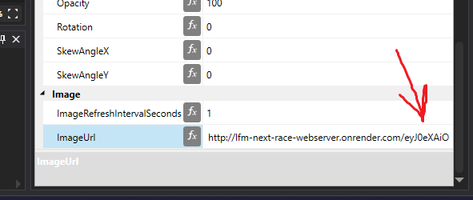
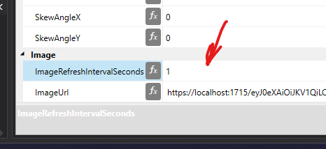

# LFM Next race poller 
This application is a simple poller from [***lowfuelmotorsport.com***](lowfuelmotorsport.com) internal API, which polls a list of your upcoming races.
This was inspired by paid feature of [lsr.gg](lsr.gg) LovelyFlags, **_which shows countdown till your next LFM race_**.


# What does script do?

This script basically polls the API, gets a detailed list of your next races, parses them, and this list is accessible over **local http server as an image**.


Why http server? So that image could be used in SimHub Dashboard over _"Image from URL"_.


Simply create a dashboard with only 1 object "imageFromUrl", set URL to "http://localhost:1715/YOUR_TOKEN_FROM_LFM", set image update time to 2~10 seconds. 
Now you can use this dashboard on any device you want, or like a screen overlay.


You can download this dashboard from releases page.

# Preparation
Before usage you need your request token. Basically it is your personal key to access your next races data.

To get the key, open LFM website, sign up for a race(any kind of race), then open developer console(F12 for Chrome) and reload the page.

Go _**Network Tab > Filter by "getMy" > click on request > copy authorization bearer**_


Now just just use this token as URL for image. 



# Usage
## Online
For normal people this script is deployed @render.com as free tier service which you can use as:
```
https://lfm-next-race-webserver.onrender.com/<your token>
```

Availability is not 100% guaranteed, sometimes it can take up to 1-2min for service to wake up. Author did this deploy for himself to use. You can use it also, your tokens are not logged nor used.


## Local EXE
For normal people that want to run app locally - there are executable file
```commandline
LFM-nextrace.exe
```
Do not forget to use local server address for ImageFromURL
```
http://localhost:1715/<your token>
```



Just launch it, and your SimHub Dashboard will successfully use it as a source of image.

You can download it in [releases](https://github.com/Suzdalev/LFM-next-race-webserver/releases) section


## Local Python
For python users
```commandline
python3.exe -m pip install -r requirements.txt
python3.exe LFM-nextrace.py
```

everything else is the same as local exe.

## Remote server
Deplay the app and run with:
```
pip install -r requirements.txt
gunicorn LFM-nextrace:app
```


# Compile
EXE fils is created by
```commandline
pyinstaller -F LFM-nextrace.py
```

