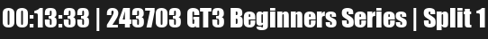
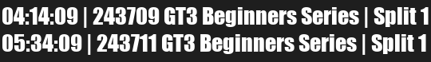
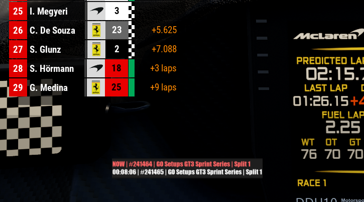
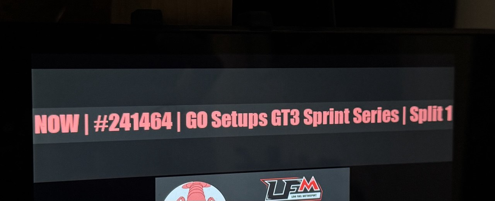
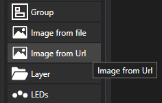
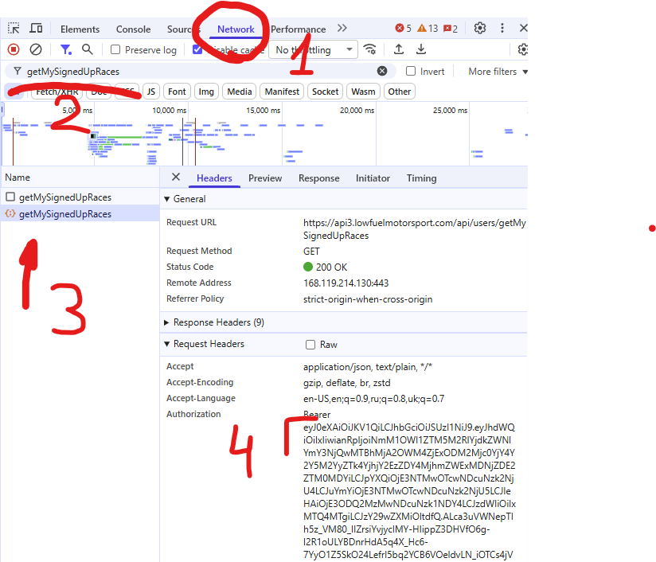

# LFM Next race poller 
This application is a simple poller from [***lowfuelmotorsport.com***](lowfuelmotorsport.com) internal API, which polls a list of your upcoming races.
This was inspired by paid feature of [lsr.gg](lsr.gg) LovelyFlags, **_which shows countdown till your next LFM race_**.


# What does script do?

This script basically polls the API, gets a detailed list of your next races, parses them, and this list is accessible over **local http server as an image**.






Why http server? So that image could be used in SimHub Dashboard over _"Image from URL"_.





Simply create a dashboard with only 1 object "imageFromUrl", set URL to "http://localhost:1715/races", set image update time to 2~10 seconds. 
Now you can use this dashboard on any device you want, or like a screen overlay.



You can download this dashboard from releases page.

# Preparation
Before usage you need your request token. Basically it is your personal key to access your next races data.

To get the key, open LFM website, sign up for a race(any kind of race), then open developer console(F12 for Chrome) and reload the page.

Go _**Network Tab > Filter by "getMy" > click on request > copy authorization bearer**_

Now just paste this token into Notepad and _**save as "bearer.txt" near your LFM-nextrace.exe**_



# Usage
For normal people there are executable file
```commandline
LFM-nextrace.exe
```

Just launch it, and your SimHub Dashboard will successfully use it as a source of image.

You can download it in releases section


# Compile

EXE fils is created by
```commandline
pyinstaller -F LFM-nextrace.py
```

For python users
```commandline
python3.exe -m pip install -r requirements.txt
python3.exe LFM-nextrace.py
```
